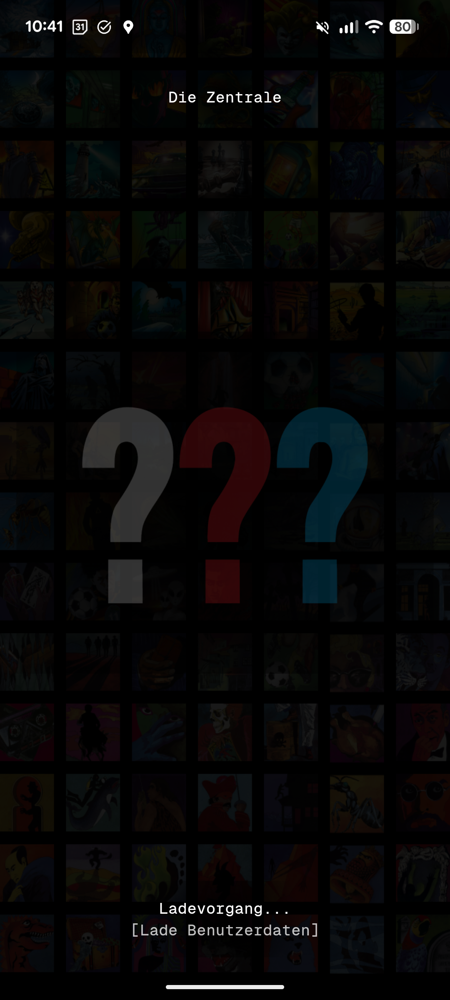
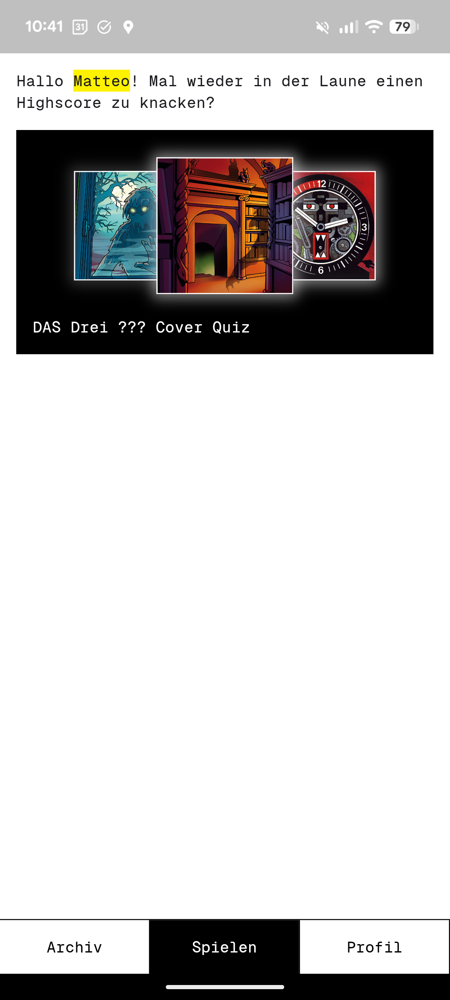
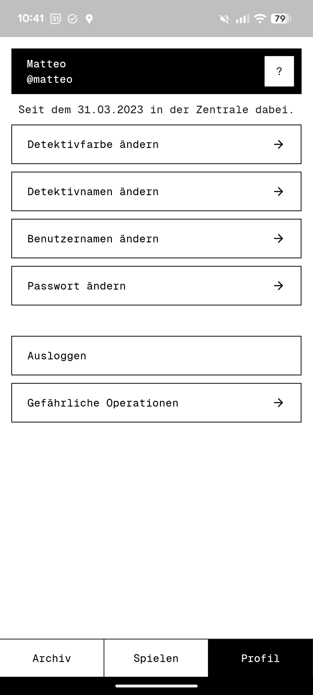
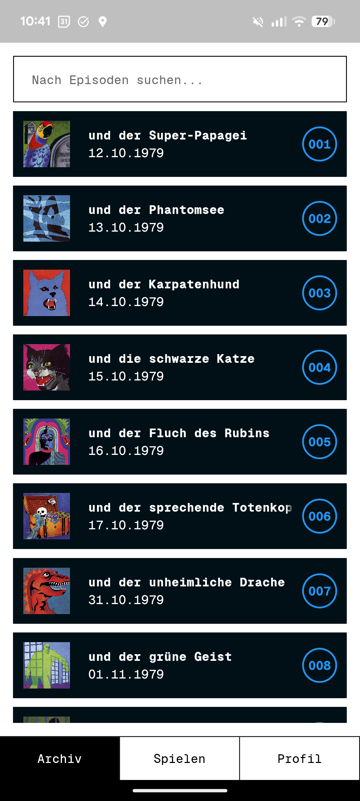
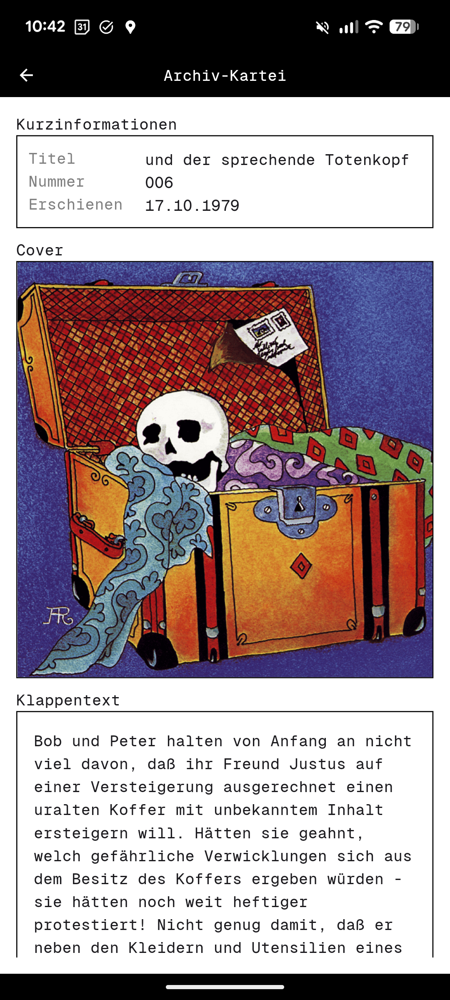
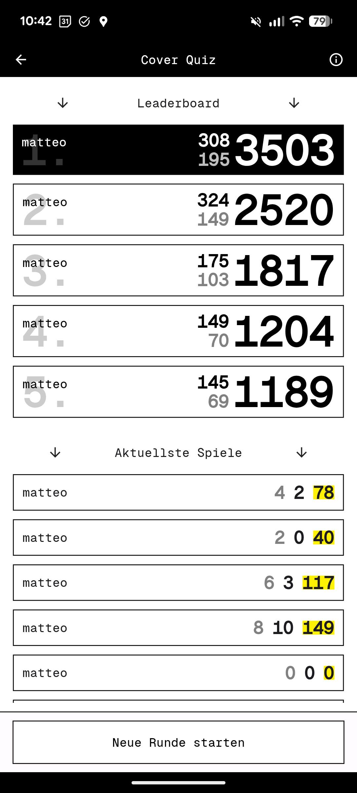
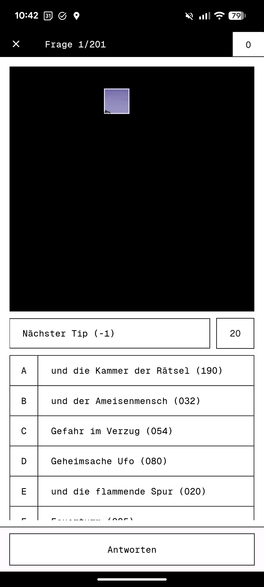

# Die Zentrale

Eine Drei ??? Cover-Quiz App für Android inspiriert durch das _3F-Bilderquiz_ der Fanseite [https://www.3fragezeichen.de/](https://www.3fragezeichen.de/). 

# Screenshots
Start-up screen: 

Homescreen: 

Profil-Screen:

Folgen-Archiv: 

Cover-Quiz:

https://github.com/user-attachments/assets/f4319e1a-4ef8-4858-bdc1-10cd661c13f4

https://github.com/user-attachments/assets/9660ddcf-bd9c-4bc8-a2b1-b107cfbf8e29

